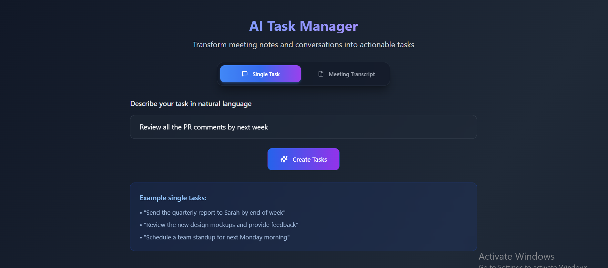
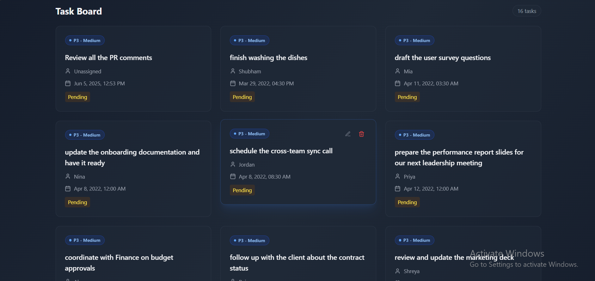

# AI Task Manager

Transform your meeting notes and conversations into actionable tasks with AI-powered intelligence. This application uses OpenAI's advanced language models to automatically extract, prioritize, and organize tasks from natural language input.

## Features

- **Natural Language Processing**: Simply describe your tasks in plain English
- **Intelligent Task Extraction**: 
  - Automatically identifies tasks from meeting notes and conversations
  - Extracts due dates, assignees, and priorities
  - Handles both single tasks and bulk meeting minutes
- **Smart Date/Time Handling**:
  - Supports various date formats (e.g., "tomorrow", "next Friday", "June 4th")
  - Handles specific times (e.g., "2pm", "10:30am")
  - Default to end of day (23:59:59) when no time specified
  - Consistent timezone handling (UTC)
  - All dates are set in year 2025 by default
- **Smart Priority Detection**:
  - P1 (Critical): For "highest priority", "urgent", "critical", "P1", "priority 1"
  - P2 (High): For "high priority", "important", "P2", "priority 2"
  - P3 (Medium): Default priority, also for "medium priority"
  - P4 (Low): For "low priority", "lowest priority", "P4", "priority 4"
- **Task Management**:
  - Clean, modern task board interface
  - Edit task details inline
  - Track task status (Pending/Completed)
  - Filter and sort tasks
- **User-Friendly Interface**:
  - Dark mode design
  - Responsive layout for all devices
  - Intuitive task creation flow
  - Real-time updates

## API Endpoints

### Task Management
- `POST /api/tasks/parse` - Parse and create tasks from text
  - Supports both single task and bulk meeting minutes
  - Returns created tasks with IDs
- `GET /api/tasks` - Get all tasks
- `PUT /api/tasks/:id` - Update task details
- `DELETE /api/tasks/:id` - Delete a task

### Request/Response Format
```json
// POST /api/tasks/parse
{
  "text": "schedule a meeting at 3pm tomorrow by John on high priority",
  "mode": "single"  // or "bulk" for meeting minutes
}

// Response
{
  "tasks": [
    {
      "id": "uuid",
      "task_name": "schedule a meeting",
      "assignee": "John",
      "due_date_time": "2025-05-31T15:00:00Z",
      "priority": "P2",
      "status": "pending",
      "created_at": "2025-05-30T05:02:39.000Z",
      "updated_at": "2025-05-30T05:02:39.000Z"
    }
  ]
}
```

---

## Setup Instructions

### Prerequisites

- Node.js (v16 or higher recommended)
- MySQL database
- OpenAI API key

---

### Backend Setup

1. Navigate to the `backend` directory:

```bash
cd backend
```

2. Install dependencies:

```bash
npm install
```

3. Setup the database:

- Create a MySQL database.
- Run the SQL script located at `backend/src/db/init.sql` to create the necessary tables.

4. Configure environment variables:

- Create a `.env` file in the `backend` directory.
- Add the following variables (replace placeholders with your actual values):

```
OPENAI_API_KEY=your_openai_api_key_here
DB_HOST=localhost
DB_USER=your_db_user
DB_PASSWORD=your_db_password
DB_NAME=your_db_name
```

> **Note:** The OpenAI API key is set as a placeholder in the `.env` file. Replace it with your actual key before running the backend.

5. Start the backend server:

```bash
npm run start
```

---

### Frontend Setup

1. Navigate to the `frontend` directory:

```bash
cd frontend
```

2. Install dependencies:

```bash
npm install
```

3. Start the frontend development server:

```bash
npm run dev
```

4. Open your browser and go to:

```
http://localhost:5173
```

---

### Database Setup

1. Install MySQL Server if you haven't already:
   - Download MySQL Community Server from [MySQL Official Website](https://dev.mysql.com/downloads/mysql/)
   - Follow the installation instructions for your operating system

2. Start MySQL Server:
   - Windows: MySQL service should start automatically
   - Linux: `sudo systemctl start mysql`
   - macOS: `brew services start mysql`

3. Create Database and Tables:
   ```bash
   # Login to MySQL (replace 'your_username' with your MySQL username)
   mysql -u your_username -p

   # Inside MySQL shell, create database and user:
   CREATE DATABASE task_converter_db;
   CREATE USER 'task_user'@'localhost' IDENTIFIED BY 'your_password';
   GRANT ALL PRIVILEGES ON task_converter_db.* TO 'task_user'@'localhost';
   FLUSH PRIVILEGES;
   EXIT;

   # Import the schema (from project root directory)
   mysql -u task_user -p task_converter_db < backend/src/db/init.sql
   ```

4. Verify Database Setup:
   ```bash
   mysql -u task_user -p
   USE task_converter_db;
   SHOW TABLES;
   ```

   You should see the following tables:
   - tasks
   - meetings
   - task_sources

5. Update Environment Variables:
   - In your `backend/.env` file, update the database configuration:
     ```
     DB_HOST=localhost
     DB_USER=task_user
     DB_PASSWORD=your_password
     DB_NAME=task_converter_db
     ```

Note: Make sure to replace 'your_password' with a secure password of your choice.

---

## Screenshots




---

## Notes

- Remember to replace the OpenAI API key placeholder in the `.env` file before running the backend.
- The frontend runs on port 5173 by default.
- The backend runs on port 3000 by default.
- All dates are handled in UTC timezone.
- Default year is set to 2025 for all tasks.
- Priority defaults to P3 if not specified.
- Time defaults to end of day (23:59:59) if not specified.

---

## .gitignore

Make sure to include the following in your `.gitignore` file:

```
node_modules/
.env
dist/
build/
```

---

